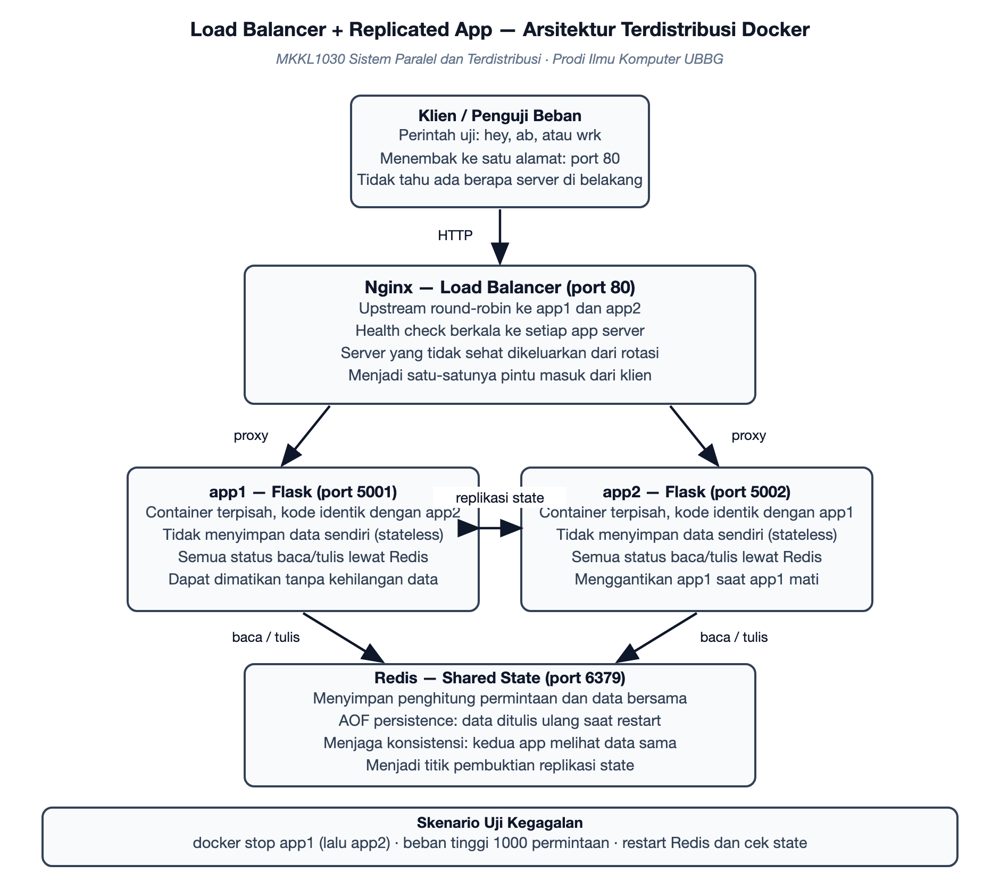

# Rencana Proyek — Load Balancer dan Replicated App — Sistem Tiga Container dengan Nginx, Flask, dan Redis

**Mata kuliah:** Sistem Paralel dan Terdistribusi (MKKL1030) · Semester 7  
**Program Studi Ilmu Komputer — Fakultas Sains, Teknologi dan Ilmu Kesehatan, Universitas Bina Bangsa Getsempena**  
**Dosen Pengampu:** Ahmad Mujahid Abdurrahman, S.Kom, M.T.  
**Versi:** 1.0 — 19 September 2026

> Salinan kerja dari dokumen rencana proyek pada Google Docs. Perubahan wajib dilakukan pada kedua tempat agar penilaian tetap sinkron.

## 1. Identitas Kelompok

| No | Nama | NIM | Peran dalam Proyek |
|---|---|---|---|
| 1 | Yogi Prasetya Sadewa | 23210060 | Ketua kelompok; berkas Docker Compose, konfigurasi Nginx, dan skenario pengujian kegagalan |
| 2 | Asmarudin | 23210133 | Aplikasi Flask dan titik akhir pemeriksaan kesehatan |
| 3 | Deski Taiza | 23210003 | Konfigurasi Redis sebagai penyimpanan status bersama dan pengujian ketahanan data |
| 4 | Akhsanul Taqwim | 23210006 | Penyiapan lingkungan Docker dan pembuatan berkas image |
| 5 | Wira | 23210045 | Pengujian beban dan pencatatan hasil pengalihan trafik |
| 6 | Abadi | 23210004 | Penyusunan skrip pengujian kegagalan yang dapat dijalankan ulang |
| 7 | Ferdyan Ardhani | 23210039 | Pencatatan dan pengolahan hasil pengujian beban menjadi tabel laporan |
| 8 | Muhammad Iqbal | 23210142 | Pemeriksaan keamanan dasar: pemisahan jaringan container dan penanganan kredensial |
| 9 | Meriandi Wahyu Kurniawan | [NIM] | Dokumentasi, README, dan pengelolaan repository |

## 2. Masalah dan Tujuan

### Masalah yang diselesaikan

Layanan yang hanya berjalan pada satu proses akan berhenti sepenuhnya ketika proses itu mati atau menerima beban berlebih. Pada sistem nyata, satu titik kegagalan seperti ini tidak dapat diterima: pengguna kehilangan layanan, dan data yang belum tersimpan dapat hilang. Proyek ini membangun purwarupa sistem terdistribusi berisi tiga komponen yang saling berkomunikasi melalui jaringan — dua app server identik di belakang sebuah load balancer dan satu penyimpanan status bersama — lalu membuktikan melalui pengujian bahwa sistem tetap melayani permintaan ketika salah satu app server dimatikan, dan bahwa data tidak hilang ketika penyimpanan bersama dinyalakan ulang.

### Latar belakang

- Purwarupa ini disusun sebagai model kecil dari pola yang dipakai layanan produksi: beberapa salinan aplikasi di belakang penyeimbang beban dengan penyimpanan bersama.
- Seluruh komponen dijalankan sebagai container terpisah sehingga kegagalan satu proses dapat disimulasikan dengan bersih tanpa memengaruhi yang lain.
- Belum ada pengukuran yang menunjukkan berapa lama layanan terhenti saat terjadi peralihan, dan seberapa merata beban terbagi.

### Pengguna sasaran

- Pengelola layanan, yang membutuhkan sistem yang tetap melayani ketika salah satu server bermasalah.
- Dosen dan mahasiswa, sebagai sarana pembelajaran konsep replikasi, konsistensi, dan toleransi kegagalan.

### Batasan lingkup

- Empat container: Nginx sebagai load balancer, dua app server Flask yang identik, dan satu Redis sebagai penyimpanan status bersama.
- Aplikasi yang dijalankan sederhana — titik akhir penghitung permintaan dan pemeriksaan kesehatan — karena penekanan proyek ada pada perilaku sistem terdistribusi, bukan pada kerumitan aplikasi.
- Pengujian dibatasi pada empat skenario: keadaan normal, matinya satu app server, beban tinggi, dan restart pada penyimpanan bersama.
- Pembuktian konsistensi dilakukan dengan membaca status yang sama dari kedua app server melalui load balancer.

### Tujuan proyek

1. Membangun sistem terdistribusi berisi minimal dua proses terpisah yang berkomunikasi melalui jaringan.
2. Menerapkan mekanisme penyeimbangan beban dan replikasi status bersama, lalu membuktikannya melalui pengujian.
3. Menguji skenario kegagalan — mematikan satu app server dan memulai ulang penyimpanan bersama — serta melaporkan perilaku sistem secara terukur.

## 3. Arsitektur Sistem

*Gambar 1. Arsitektur sistem terdistribusi: klien, load balancer, dua app server, dan penyimpanan status bersama.*

### Komponen utama

- Nginx sebagai load balancer: menerima seluruh permintaan klien pada satu alamat dan membagikannya ke app server yang sehat.
- Dua app server Flask yang identik: tidak menyimpan data sendiri, sehingga dapat dimatikan dan dinyalakan tanpa kehilangan status.
- Redis sebagai penyimpanan status bersama: menyimpan penghitung permintaan dengan penyimpanan ulang berkala (AOF) agar data bertahan setelah restart.
- Klien penguji beban: perkakas pembangkit permintaan untuk menilai pemerataan beban dan perilaku saat beban tinggi.
- Berkas Docker Compose: mendefinisikan seluruh container, jaringan internal, dan aturan ketergantungan antar layanan.

### Alur data dan protokol

- Klien mengirim permintaan ke Nginx, satu-satunya pintu masuk sistem, tanpa mengetahui berapa app server yang berjalan di belakangnya.
- Nginx memilih app server secara bergiliran (round-robin) dan meneruskan permintaan melalui jaringan internal Docker.
- App server membaca dan menambah penghitung pada Redis, sehingga status yang dilihat kedua app server selalu sama.
- Nginx melakukan pemeriksaan kesehatan berkala; app server yang tidak menjawab dikeluarkan dari rotasi sampai kembali sehat.
- Setiap respons memuat identitas app server yang melayani, sehingga pemerataan beban dan peralihan dapat dibuktikan dari luar.

## 4. Tools dan Lingkungan

- Perangkat lunak: Docker dan Docker Compose sebagai lingkungan utama.
- Bahasa dan kerangka kerja: Python 3 dengan Flask untuk app server.
- Load balancer: Nginx dengan pengaturan upstream dan pemeriksaan kesehatan.
- Penyimpanan status: Redis dengan penyimpanan ulang AOF.
- Perkakas uji: hey atau ApacheBench untuk beban, serta skrip pembaca log untuk merangkum hasil.
- Kolaborasi: GitHub untuk kode dan dokumentasi, Google Docs untuk rencana proyek, serta Issues untuk pembagian tugas.

## 5. Rencana Pencapaian UTS (Pertemuan 8)

*Target ini menjadi acuan penilaian: capaian kelompok pada Pertemuan 8 dibandingkan dengan janji berikut.*

| Bagian yang dijanjikan selesai | Bentuk bukti pada Pertemuan 8 | Penanggung jawab |
|---|---|---|
| Seluruh container berjalan dan klien dapat mengakses layanan melalui load balancer | Keluaran docker compose ps dan tangkapan layar respons pertama | Akhsanul Taqwim |
| App server mengembalikan identitasnya dan penghitung permintaan tersimpan di Redis | Respons berisi identitas app server dan isi kunci penghitung pada Redis | Asmarudin |
| Nginx membagi permintaan ke kedua app server dan memeriksa kesehatan secara berkala | Log Nginx yang memperlihatkan permintaan terbagi ke kedua app server | Yogi Prasetya Sadewa |
| Percobaan pertama: salah satu app server dimatikan saat beban berjalan | Catatan waktu peralihan dan log Nginx yang menunjukkan pengalihan trafik | Wira |
| Penyimpanan bersama menyimpan ulang data dan status tetap ada setelah restart | Hasil pembacaan status sebelum dan sesudah container Redis dimulai ulang | Deski Taiza |
| Skrip pengujian kegagalan tersedia dan dapat dijalankan ulang oleh anggota lain | Berkas skrip pengujian beserta keluaran satu kali dijalankan | Abadi |
| Hasil pengujian beban diolah menjadi tabel ringkasan untuk laporan | Tabel ringkasan hasil pengujian beban tinggi | Ferdyan Ardhani |
| Repository aktif: README, berkas Compose, dan riwayat commit | Riwayat commit mingguan dan tautan repository | Meriandi Wahyu Kurniawan |

## 6. Rencana Pencapaian UAS (Pertemuan 16) dan Skenario Demonstrasi

### Definisi produk akhir

- Sistem tiga komponen yang berjalan penuh dan dapat dijalankan ulang dari satu berkas Compose.
- Laporan pengujian lengkap: pemerataan beban, waktu peralihan saat kegagalan, hasil pengujian beban tinggi, dan pembuktian ketahanan status setelah restart.
- Dokumentasi arsitektur dan penjelasan keputusan teknis, termasuk alasan aplikasi dibuat tanpa status sendiri.

### Skenario demonstrasi

1. Menjalankan seluruh container dari berkas Compose dan memperlihatkan layanan dapat diakses.
2. Mengirim banyak permintaan dan memperlihatkan distribusi yang merata pada kedua app server.
3. Mematikan salah satu app server saat permintaan sedang berjalan, lalu memperlihatkan layanan tetap merespons tanpa kegagalan.
4. Menyalakan kembali app server yang mati dan memperlihatkan ia masuk kembali ke rotasi.
5. Memulai ulang container Redis dan memperlihatkan status bersama tetap utuh.
6. Menjalankan pengujian beban tinggi dan menyajikan ringkasan hasilnya sebagai temuan utama.
7. Setiap anggota menjelaskan modul yang dikerjakannya, dipilih langsung oleh dosen.

## 7. Pembagian Kerja per Minggu

| Minggu | Kegiatan utama | Luaran |
|---|---|---|
| Ke-2 | Finalisasi rencana, penyiapan Docker pada masing-masing perangkat, dan penyiapan repository | Rencana proyek dan repository siap |
| Ke-3 | Membangun app server Flask beserta titik akhir penghitung dan pemeriksaan kesehatan | App server berjalan dan dapat diakses langsung |
| Ke-4 | Menambahkan Redis sebagai penyimpanan status bersama | Status permintaan tersimpan dan terbaca dari kedua app server |
| Ke-5 | Menambahkan Nginx sebagai load balancer dan menggabungkan seluruh layanan pada berkas Compose | Satu perintah menjalankan seluruh sistem |
| Ke-6 | Pengujian pemerataan beban dan pencatatan identitas app server pada respons | Tabel distribusi permintaan per app server |
| Ke-7 | Pengujian kegagalan pertama dan pengujian beban, penyusunan bahan UTS | Catatan waktu peralihan dan bahan UTS lengkap |
| Ke-8 | Pembahasan progres UTS dan tindak lanjut catatan dosen | Catatan perbaikan dan rencana revisi |
| Ke-9 s.d. 15 | Pengulangan pengujian, pengujian restart penyimpanan bersama, dan penyusunan laporan akhir | Data lengkap dan laporan pengujian |
| Ke-16 | Presentasi dan demonstrasi produk akhir | Produk akhir dan laporan final |

## 8. Risiko dan Rencana Cadangan

| Risiko | Rencana cadangan |
|---|---|
| Docker tidak dapat dijalankan pada perangkat anggota karena keterbatasan sistem | Gunakan satu perangkat sebagai lingkungan utama pengujian, dan sediakan berkas Compose yang sama agar anggota lain dapat menjalankannya menyusul. |
| Pemeriksaan kesehatan Nginx tidak mendeteksi kegagalan dengan cepat sehingga peralihan terasa lambat | Atur selang dan ambang pemeriksaan kesehatan, lalu ukur waktu peralihan pada beberapa nilai berbeda dan laporkan yang terbaik. |
| Penyimpanan status bersama menjadi titik kegagalan tunggal yang baru | Jelaskan keterbatasan ini secara terbuka di laporan sebagai bahan diskusi lanjutan, misalnya dengan menambahkan salinan cadangan. |
| Hasil pengujian beban berbeda-beda tergantung spesifikasi perangkat | Catat spesifikasi perangkat dan waktu pengujian pada setiap sesi, lalu bandingkan hasil antar-perangkat secara kualitatif, bukan angka mutlak. |
| Anggota tidak aktif sehingga jadwal meleset | Setiap bagian memiliki penanggung jawab cadangan; ketua melaporkan kondisi ini pada sesi progres kepada dosen. |

## 9. Riwayat dan Pembaruan Dokumen

Versi 1.0 — 19 September 2026: dokumen awal disusun setelah penetapan topik, memuat rencana pencapaian UTS, rencana pencapaian UAS, pembagian kerja per minggu, serta risiko dan rencana cadangan. Dokumen ini maksimal empat halaman dan diperbarui pada setiap sesi pembahasan progres mingguan.

- `19 September 2026` — v1.0 dokumen awal dibuat.